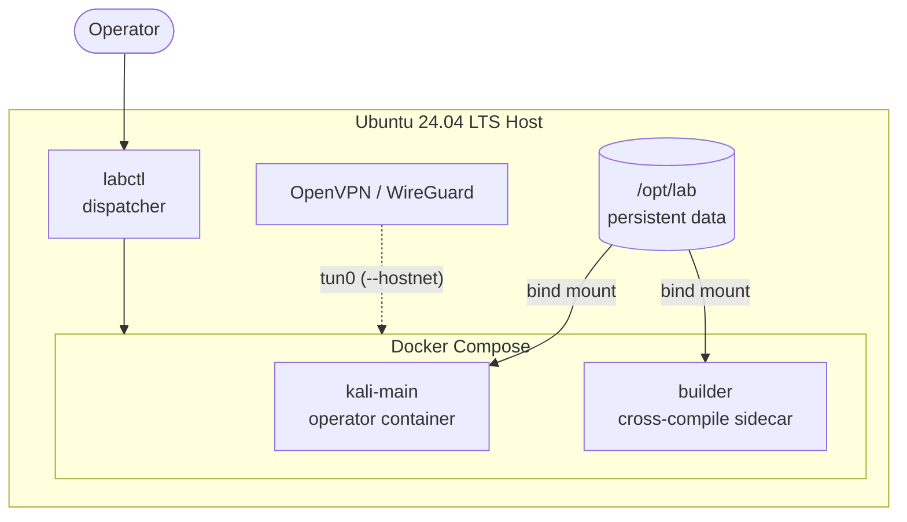

# Hecate

[](https://github.com/Icarus4122/hecate-bootstrap/actions/workflows/ci.yml)
[](LICENSE)
[](#host-requirements)
[](labctl)
[](#architecture)

**Dockerized operator platform and workstation bootstrap for terminal-first security operations.**

> Platform layer for [Empusa](https://github.com/Icarus4122/empusa) - *"the crossroads daemon."*

Hecate bootstraps a dedicated offensive-security workstation from a fresh Ubuntu 24.04 install.
Everything runs in Docker - a Kali Rolling container for daily operator work, and an
optional Ubuntu builder sidecar for cross-compilation.  Persistent operational data lives
on the host at `/opt/lab` and survives container rebuilds.

This is a workstation bootstrap project, not a simulation lab.  It produces one operator
environment, not a network of targets.

---

## Quick Links

[](docs/architecture.md)
[](docs/labctl.md)
[](docs/empusa.md)
[](docs/troubleshooting.md)
[](SECURITY.md)

---

## Table of Contents

- [Hecate](#hecate)
  - [Quick Links](#quick-links)
  - [Table of Contents](#table-of-contents)
  - [Architecture](#architecture)
  - [Host Requirements](#host-requirements)
  - [Repository Structure](#repository-structure)
  - [Persistent Data Model](#persistent-data-model)
  - [Bootstrap Sequence](#bootstrap-sequence)
  - [Image Build](#image-build)
  - [Launch Workflow](#launch-workflow)
    - [default](#default)
    - [htb](#htb)
    - [build](#build)
    - [research](#research)
  - [tmux](#tmux)
  - [Binary Sync](#binary-sync)
  - [Empusa](#empusa)
  - [GPU Overlay](#gpu-overlay)
  - [Host-Network Overlay](#host-network-overlay)
  - [Workflow Examples](#workflow-examples)
    - [First-Time Setup](#first-time-setup)
    - [HTB / Offensive Engagement](#htb--offensive-engagement)
    - [Research Session](#research-session)
    - [Build / Cross-Compilation](#build--cross-compilation)
    - [GPU + Host-Network VPN](#gpu--host-network-vpn)
    - [Troubleshooting](#troubleshooting)
  - [labctl Reference](#labctl-reference)
    - [Lifecycle](#lifecycle)
    - [Interaction](#interaction)
    - [Tooling](#tooling)
    - [Workflow](#workflow)
    - [Ops](#ops)
  - [Environment Variables](#environment-variables)
  - [Host Verification](#host-verification)
  - [Platform Update](#platform-update)
  - [Adding Tools](#adding-tools)
  - [Tests](#tests)
    - [CI workflows](#ci-workflows)
    - [What is tested](#what-is-tested)
    - [What requires manual or self-hosted verification](#what-requires-manual-or-self-hosted-verification)
  - [Troubleshooting](#troubleshooting-1)
  - [What Is Excluded from Git](#what-is-excluded-from-git)
  - [License](#license)

---

## Architecture



Compose overlays control optional features:

| Overlay | Stacked when | Effect |
| --------- | ------------- | -------- |
| `docker-compose.gpu.yml` | `LAB_GPU=1` or `--gpu` | NVIDIA device passthrough |
| `docker-compose.hostnet.yml` | `LAB_HOSTNET=1` or `--hostnet` | `network_mode: host` (direct tun0 access) |

## Host Requirements

| Dependency | Minimum | Notes |
| --- | --- | --- |
| Ubuntu | 24.04 LTS (amd64) | Required |
| Docker Engine | with Compose plugin | Installed by bootstrap |
| NVIDIA GPU + driver | optional | For hashcat / GPU workloads |

## Repository Structure

```text
hecate-bootstrap/
├── labctl                          -> thin command dispatcher
├── .env.example                    -> config template (never commit .env)
├── .gitignore
├── README.md
│
├── compose/
│   ├── docker-compose.yml          -> base stack (bridge, kali-main + builder)
│   ├── docker-compose.gpu.yml      -> NVIDIA GPU overlay
│   └── docker-compose.hostnet.yml  -> host-network overlay
│
├── docker/
│   ├── kali-main/
│   │   ├── Dockerfile              -> Kali Rolling CLI image
│   │   ├── apt-packages.txt        -> operator apt packages (~55 packages)
│   │   ├── pipx-packages.txt       -> pipx tools (uploadserver)
│   │   └── rootfs/
│   │       └── root/.bashrc        -> shell config, aliases, PATH
│   └── builder/
│       ├── Dockerfile              -> Ubuntu 24.04 cross-compilation image
│       └── apt-packages.txt        -> build toolchain packages
│
├── scripts/
│   ├── bootstrap-host.sh           -> one-time host provisioning (8 steps)
│   ├── launch-lab.sh               -> profile-aware lab launch (authoritative)
│   ├── verify-host.sh              -> pre-flight host readiness checks
│   ├── update-lab.sh               -> safe platform update orchestrator
│   ├── sync-binaries.sh            -> GitHub API-driven binary download + verify
│   ├── create-workspace.sh         -> engagement workspace scaffolding
│   ├── install-empusa.sh           -> Empusa install / update / reinstall
│   ├── update-empusa.sh            -> delegates to install-empusa.sh update
│   └── setup-nvidia.sh             -> NVIDIA container toolkit installer
│
├── tmux/
│   ├── .tmux.conf                  -> base config (bind-mounted into containers)
│   └── profiles/
│       ├── default.sh              -> 2 windows: main, ops
│       ├── htb.sh                  -> 2 windows: main, ops (workspace arg required)
│       ├── build.sh                -> 2 windows: build, tools
│       └── research.sh             -> 2 windows: research, notes
│
├── manifests/
│   ├── apt-host.txt                -> host apt packages for bootstrap
│   └── binaries.tsv                -> pinned binary manifest (TSV, 7 columns)
│
├── templates/                      -> markdown engagement/methodology templates
│   ├── engagement.md               target.md    recon.md
│   ├── services.md                 web.md       privesc.md
│   ├── pivot.md                    ad.md        finding.md
│
└── docs/
    ├── architecture.md             labctl.md
    ├── gpu-passthrough.md          vpn-routing.md
    ├── troubleshooting.md          empusa.md
```

## Persistent Data Model

All operational data lives on the host at `/opt/lab` and is bind-mounted into containers:

```text
/opt/lab/
├── data/             -> scan output, loot, engagement artifacts
├── tools/
│   ├── binaries/     -> synced external binaries (chisel, ligolo, …)
│   ├── git/          -> cloned tool repos (Empusa, …)
│   └── venvs/        -> isolated Python venvs (Empusa, …)
├── resources/        -> staged transfer files, payloads
├── workspaces/       -> engagement directories (flat; profile in metadata)
│   └── <name>/       -> profiled workspace (notes, scans, loot, …)
├── knowledge/        -> reference material, notes
└── templates/        -> seeded report templates
```

This directory survives `labctl clean` and container rebuilds.

## Bootstrap Sequence

From a fresh Ubuntu 24.04 install:

```bash
git clone <repo> ~/hecate-bootstrap && cd ~/hecate-bootstrap
sudo labctl bootstrap
```

Bootstrap runs 8 steps:

1. Install host apt packages from `manifests/apt-host.txt`
2. Install Docker Engine + Compose plugin
3. Add current user to `docker` group
4. Install NVIDIA Container Toolkit (if GPU detected)
5. Create `/opt/lab` directory tree
6. Seed `.env` from `.env.example`
7. Install Empusa (if repo available)
8. Symlink `labctl` to `/usr/local/bin/`

After bootstrap, re-login (for docker group), then:

```bash
labctl sync                 # download pinned binaries
labctl build                # build container images
labctl up                   # start kali-main
```

## Image Build

```bash
labctl build                # build all images
labctl build --no-cache     # force full rebuild
labctl rebuild              # alias for build --no-cache
```

Images are built from the repo root context.  Package manifests are `COPY`'d into the
build and processed with `sed` to strip comments before passing to `apt-get install`.

## Launch Workflow

`labctl launch` is the primary way to start working.  It creates workspace directories,
brings up the compose stack, `exec`s into `kali-main`, and runs the matching tmux profile.

### default

```bash
labctl launch default
```

General-purpose session.  Two tmux windows (`main`, `ops`) starting at `/opt/lab`.

### htb

```bash
labctl launch htb resolute
```

Creates `/opt/lab/workspaces/resolute/` with subdirectories:
`notes/`, `scans/`, `web/`, `creds/`, `loot/`, `exploits/`, `screenshots/`, `reports/`, `logs/`.

Enters `kali-main` with the htb tmux profile.  Both windows start in the workspace.
Session name is `htb-resolute` so multiple targets can run concurrently.

### build

```bash
labctl launch build internal-webapp    # with project workspace
labctl launch build               # defaults to /opt/lab/tools
```

Starts both `kali-main` and the `builder` sidecar.  The operator works inside `kali-main`
with the build tmux profile.  The `builder` service is a headless Ubuntu environment for
cross-compilation - it shares `/opt/lab/tools` and can be reached via `labctl shell builder`.

### research

```bash
labctl launch research cve-2024-1234
labctl launch research
```

Creates `/opt/lab/workspaces/<topic>/` if a topic is given.
Two tmux windows (`research`, `notes`).

## tmux

The base config (`tmux/.tmux.conf`) is bind-mounted read-only into containers at `/etc/tmux.d/`
and symlinked to `~/.tmux.conf` at image build time.

| Setting | Value |
| --- | --- |
| Prefix | `C-a` |
| Mouse | enabled |
| Scrollback | 50,000 lines |
| Copy mode | vi keys |
| Window/pane numbering | starts at 1 |

To use profiles directly (inside the container):

```bash
bash /etc/tmux.d/profiles/default.sh
bash /etc/tmux.d/profiles/htb.sh /opt/lab/workspaces/mybox
```

## Binary Sync

Pinned external binaries are defined in `manifests/binaries.tsv` and downloaded via the
GitHub Releases API - not by scraping HTML download links.

```bash
labctl sync                       # sync all entries
labctl sync --name chisel         # sync one entry
labctl sync --dry-run             # preview without downloading
```

Each download is validated with `file(1)`.  HTML, XML, and plain-text responses are
rejected automatically.  For `all-assets` mode (e.g. chisel), every release asset is
downloaded into a versioned subdirectory.

Set `GITHUB_TOKEN` to raise the API rate limit from 60 to 5,000 requests/hour:

```bash
GITHUB_TOKEN=ghp_xxx labctl sync
```

Manifest format (TSV, 7 columns):

| Column | Example |
| -------- | --------- |
| name | `chisel` |
| type | `github-release` |
| repo | `jpillora/chisel` |
| tag | `v1.11.4` |
| mode | `all-assets` or exact filename |
| dest | `chisel/v1.11.4` |
| flags | `-`, `executable`, `allow-text` |

## Empusa

Empusa is the preferred workspace orchestrator.  When installed, `labctl workspace`,
`labctl launch`, and `create-workspace.sh` all delegate workspace creation, template
seeding, and session activation to Empusa.  A minimal shell fallback exists for
environments where Empusa is not yet installed - it creates four generic directories
(`notes/`, `scans/`, `loot/`, `logs/`) with no profile-specific layout, no templates,
and no event emission.

```bash
scripts/install-empusa.sh install     # clone + venv + editable install
scripts/install-empusa.sh update      # git pull + reinstall
scripts/install-empusa.sh reinstall   # destroy venv, rebuild from scratch
```

| Path | Purpose |
| --- | --- |
| `/opt/lab/tools/git/empusa` | Cloned source repo |
| `/opt/lab/tools/venvs/empusa` | Isolated Python venv |

See [docs/empusa.md](docs/empusa.md) for delegation behavior and workspace profiles.

## GPU Overlay

```bash
labctl up --gpu
# or
LAB_GPU=1 labctl up
```

Requires NVIDIA driver + `nvidia-container-toolkit` on the host (installed during
bootstrap if a GPU is detected).  The overlay reserves all NVIDIA devices and sets
`NVIDIA_DRIVER_CAPABILITIES=compute,utility`.

Verify inside the container:

```bash
labctl shell
nvidia-smi
hashcat -I
```

## Host-Network Overlay

```bash
labctl up --hostnet
# or
LAB_HOSTNET=1 labctl up
```

Switches containers to `network_mode: host`.  The container shares the host network
stack, including `tun0` - useful when the VPN is running on the host and you need
direct access from inside the container without NAT.

VPN always runs on the host, never inside containers.

---

## Workflow Examples

Copy-pasteable commands for the most common operator workflows.  Each example
uses realistic names — substitute your own target, project, or topic.

### First-Time Setup

```bash
sudo labctl bootstrap                   # provision host (once)
# log out and back in for docker group
labctl sync                             # download pinned binaries
labctl build                            # build the kali-main image
labctl up                               # start the lab
labctl launch default                   # enter kali-main via tmux
```

### HTB / Offensive Engagement

```bash
labctl launch htb resolute              # workspace + tmux session htb-resolute
labctl launch htb resolute              # re-run to reattach to existing session
```

### Research Session

```bash
labctl launch research cve-2024-1234    # workspace + tmux session research-cve-2024-1234
```

### Build / Cross-Compilation

```bash
labctl launch build internal-webapp     # workspace + builder sidecar + tmux
labctl shell builder                    # shell into the builder container
```

### GPU + Host-Network VPN

```bash
labctl up --gpu --hostnet               # GPU passthrough + direct tun0 access
labctl shell                            # enter kali-main
hashcat -I                              # verify GPU is visible
```

### Troubleshooting

```bash
labctl verify                           # pre-flight host checks (always safe)
labctl status                           # quick dashboard — what is running?
labctl logs kali-main                   # container logs
labctl clean && labctl rebuild          # nuclear reset (preserves /opt/lab)
```

---

## labctl Reference

### Lifecycle

| Command | Description |
| --- | --- |
| `labctl up [--gpu] [--hostnet] [--builder]` | Start containers.  Flags stack compose overlays and profiles. |
| `labctl down` | Stop and remove containers. |
| `labctl build [--no-cache]` | Build images from Dockerfiles. |
| `labctl rebuild` | Build images without cache. |
| `labctl clean` | Remove containers, volumes, prune dangling images.  `/opt/lab` is never touched. |

### Interaction

| Command | Description |
| --- | --- |
| `labctl shell [container]` | Exec bash into a container (default: `kali-main`). |
| `labctl logs [container]` | Follow container logs. |

### Tooling

| Command | Description |
| --- | --- |
| `labctl sync [-n NAME] [--dry-run]` | Sync pinned external binaries from `manifests/binaries.tsv`. |
| `labctl tmux <profile>` | Launch a named tmux session.  Profiles: `default`, `htb`, `build`, `research`. |

### Workflow

| Command | Description |
| --- | --- |
| `labctl launch <profile> [target]` | Workspace + compose up + kali-main tmux session.  Profiles: `default`, `htb`, `build`, `research`.  Uses Empusa when available. |
| `labctl workspace <name> [--profile P]` | Create workspace via Empusa (profiles: `htb`, `build`, `research`, `internal`).  Falls back to minimal scaffold without Empusa. |

### Ops

| Command | Description |
| --- | --- |
| `labctl status` | Lab health: containers, VPN, GPU, disk usage, workspace count. |
| `labctl verify` | Read-only pre-flight host checks.  Returns non-zero on critical failures. |
| `labctl update [flags]` | Safe platform update.  See [Environment Variables](#environment-variables) and [Platform Update](#platform-update). |
| `labctl bootstrap` | One-time host provisioning (requires `sudo`). |

For full flag documentation, see [docs/labctl.md](docs/labctl.md).

---

## Environment Variables

| Variable | Type | Default | Used by | Effect |
| --- | --- | --- | --- | --- |
| `LAB_ROOT` | path | `/opt/lab` | all scripts | Persistent data root |
| `LAB_GPU` | `0\|1` | `0` | `labctl`, `launch-lab.sh`, `update-lab.sh` | Stack GPU compose overlay |
| `LAB_HOSTNET` | `0\|1` | `0` | `labctl`, `launch-lab.sh`, `update-lab.sh` | Stack host-network compose overlay |
| `COMPOSE_PROJECT_NAME` | string | `lab` | `labctl`, `launch-lab.sh`, `update-lab.sh` | Docker Compose project name |
| `GITHUB_TOKEN` | string | *(unset)* | `sync-binaries.sh` | GitHub PAT - raises API rate limit from 60 -> 5,000 req/hr |
| `EMPUSA_REPO` | URL | `https://github.com/Icarus4122/empusa.git` | `install-empusa.sh` | Empusa clone URL |

## Host Verification

```bash
labctl verify
LAB_GPU=1 labctl verify          # include GPU runtime checks
```

Runs read-only pre-flight checks: OS version, required commands, Docker health,
`/opt/lab` layout, repo file presence, Empusa installation, binary sync state, and GPU
runtime.  Returns non-zero on critical failures.  Does not modify the system.

## Platform Update

```bash
labctl update --pull --empusa --binaries   # full update
labctl update --pull --force               # pull + rebuild, no prompts
labctl update --empusa --no-build          # update Empusa only
labctl update                              # rebuild + restart only
```

Safe update orchestrator.  Runs `verify-host.sh` first, then optionally pulls the repo,
updates Empusa, syncs binaries, rebuilds images, and restarts the compose stack.
`/opt/lab` is never touched.  On build failure, running containers are left intact.

| Flag | Type | Effect |
| --- | --- | --- |
| `--pull` | boolean | `git pull --ff-only` the hecate-bootstrap repo before rebuild |
| `--empusa` | boolean | Update Empusa via `install-empusa.sh update` |
| `--binaries` | boolean | Refresh external binaries via `sync-binaries.sh` |
| `--no-build` | boolean | Skip image rebuild |
| `--no-restart` | boolean | Skip compose restart after rebuild |
| `--builder` | boolean | Include builder profile in restart |
| `--gpu` | boolean | Set `LAB_GPU=1` for compose operations |
| `--hostnet` | boolean | Set `LAB_HOSTNET=1` for compose operations |
| `--force` | boolean | Bypass confirmation prompts |

## Adding Tools

| Type | Edit | Then |
| ------ | ------ | ------ |
| Kali apt package | `docker/kali-main/apt-packages.txt` | `labctl rebuild` |
| Python tool (pipx) | `docker/kali-main/pipx-packages.txt` | `labctl rebuild` |
| Builder apt package | `docker/builder/apt-packages.txt` | `labctl rebuild` |
| External binary | `manifests/binaries.tsv` | `labctl sync` |
| Host apt package | `manifests/apt-host.txt` | Re-run bootstrap |

## Tests

```bash
bash tests/run-all.sh
```

The `tests/` directory contains TAP-style shell tests that exercise script logic in
sandboxed temp directories.  No Docker, network access, or real host OS is required.
CI runs the same suite on every push and PR to `main`.

### CI workflows

| Workflow | Trigger | What it checks |
| -------- | ------- | -------------- |
| **CI** (`ci.yml`) | push / PR to `main` | Shell syntax (`bash -n`), ShellCheck lint, TAP shell tests, repo file inventory, compose config validation |
| **Platform Validation** (`platform-validation.yml`) | `workflow_dispatch` | Full e2e harness (8 stages, 10 scenarios, 941+ checks) — requires self-hosted runner with root + Docker |
| **Contract Validation** (`contract-validation.yml`) | `workflow_dispatch` + weekly | Cross-repo Hecate ↔ Empusa contract checks (profiles, templates, events, CLI) |
| **Release Sanity** (`release-sanity.yml`) | `workflow_dispatch` | Version consistency, changelog alignment, lint, tests across both repos |

### What is tested

| Script | Coverage |
| -------- | ---------- |
| `verify-host.sh` | `_pass`/`_warn`/`_fail` counters, `check_lab_layout`, `check_repo_files`, `check_empusa`, `print_summary` exit-code logic |
| `launch-lab.sh` | Compose file stacking (base / GPU / hostnet / both), `ensure_workspace` fallback scaffold, `launch_htb` target requirement, unknown-profile dispatch |
| `create-workspace.sh` | Usage output, fallback scaffold directories, idempotency, `--profile` flag |
| `update-lab.sh` | `parse_flags` (all 9 flags + unknown), `step_verify_repo`, summary tracking (`_done`/`_skipped`/`_failed`), `step_summary` failure detection, skip-by-default |
| `sync-binaries.sh` | `validate_download` (ELF / HTML / XML / text / gzip), argument parsing (gated on `jq` availability) |
| Empusa resolution | 3-step resolution order (venv -> PATH -> fallback), priority when both exist |

### What requires manual or self-hosted verification

These areas depend on Docker, network, GPU hardware, or a real Ubuntu host.
Use the **Platform Validation** workflow on a self-hosted runner, or run locally:

```bash
# Full platform validation (requires root + Docker)
sudo bash tests/e2e/run-validation.sh

# Stages only (subsystem checks)
sudo bash tests/e2e/run-validation.sh --stages-only

# Single scenario
sudo bash tests/e2e/run-validation.sh --scenario fresh-bootstrap

# Dry run (show test plan)
bash tests/e2e/run-validation.sh --dry-run
```

| Area | Reason | Covered by |
| ------ | -------- | ---------- |
| `check_docker`, compose up/down/restart | Requires a running Docker daemon | E2E stages 2-5 |
| `check_os` (Ubuntu 24.04 detection) | Requires specific host OS | E2E stage 0 |
| `check_gpu`, NVIDIA runtime checks | Requires physical GPU + driver | E2E overlay-matrix scenario |
| `fetch_release`, `download_one`, binary sync | Hits the GitHub API | E2E stage 2 |
| Full operator journeys | Requires containers, workspaces, tmux | E2E scenarios 1-7 |
| `bootstrap-host.sh` | Modifies the system (apt, usermod, symlinks) | E2E stage 1 |

Run `labctl verify` on a live host to cover these areas.

## Troubleshooting

See [docs/troubleshooting.md](docs/troubleshooting.md) for solutions to common issues including:

| Topic | Summary |
| --- | --- |
| Docker permissions / daemon | `usermod`, `systemctl`, compose plugin |
| GPU / NVIDIA passthrough | Driver, runtime config, hashcat verification |
| VPN routing | Host-network mode vs bridge NAT forwarding |
| Empusa fallback mode | Install or reinstall Empusa to restore profile-aware workspaces |
| Path drift | Ensure `LAB_ROOT` is consistent across `.env`, shell, and scripts |
| Kali package renames | Check [pkg.kali.org](https://pkg.kali.org/) for current names |
| Binary sync HTML errors | Token, tag, and asset name mismatches |
| Update failures | Build retry, cache invalidation, stash-and-pull |

---

## What Is Excluded from Git

Defined in `.gitignore`:

| Excluded | Reason |
| --- | --- |
| `.env` | Contains local config, may hold secrets |
| `*.ovpn`, `*.conf.secret` | VPN credentials |
| `creds/`, `loot/`, `screenshots/` | Operational artifacts |
| `*.pcap` | Network captures |
| `/opt/lab/*` | Runtime data (not in repo tree) |
| Built images, `__pycache__`, `.venv/` | Generated artifacts |

Excluded by design (not `.gitignore`, but out of scope):

| Not here | Reason |
| --- | --- |
| VPN setup | Host-managed; varies per engagement |
| Target VMs / ranges | Out of scope; this is a workstation, not a range |
| GUI / RDP / VNC | CLI-only by design |
| Payload generation (veil, msfvenom presets) | Runtime, not baked in |
| Global Python packages | Use pipx in the image or venvs on the host |

---

## License

This project is licensed under **GNU GPL v3**. See [LICENSE](LICENSE) for the full text.
