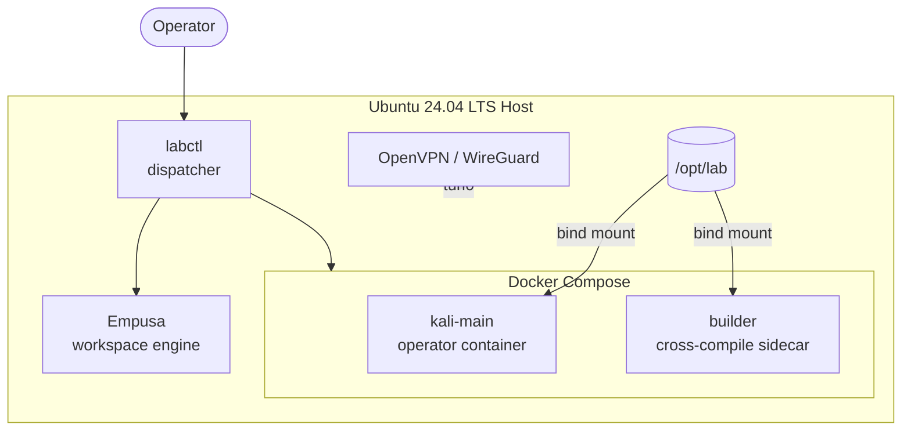
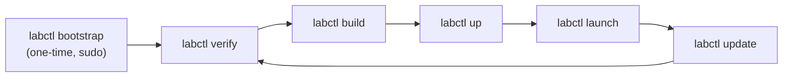

# Architecture



## Key Decisions

| Decision | Rationale |
| ---------- | ----------- |
| Bridge default, host optional | Bridge isolates containers from VPN noise; host mode available via `--hostnet` when needed. |
| GPU as compose overlay | Lab works without NVIDIA drivers; overlay activates passthrough cleanly. |
| `labctl` dispatcher | Single entry point hides compose-file stacking, environment variables, and path wiring. |
| Text-file manifests | Diffable, versionable, decoupled from Dockerfiles. Edit a list, rebuild. |
| SHA-256 binary sync | Reproducible, verifiable, keeps large files out of git. |
| Empusa as preferred orchestrator | Empusa handles workspace creation, template seeding, session state, and event emission.  A minimal shell fallback (4 generic directories, no profiles, no templates) provides compatibility when Empusa is not installed. |
| `docker/*/rootfs/` pattern | Files under rootfs/ are COPY'd into the image root, keeping shell configs versionable without layering complexity. |
| Containers disposable | `labctl clean` is safe — /opt/lab is never touched. |
| `verify-host.sh` before update | `update-lab.sh` runs pre-flight verification to catch drift before rebuilding. |
| Shell test suite | `tests/` exercises script logic (flag parsing, workspace scaffolding, compose stacking, Empusa resolution) in sandboxed environments.  Docker/network/GPU paths are verified manually via `labctl verify`. |

## Operational Lifecycle



## Host Layout

```text
/opt/lab/
├── data/             engagement artifacts, scan output
├── tools/
│   ├── binaries/     synced external binaries (chisel, ligolo, …)
│   ├── git/          cloned tool repos (empusa, …)
│   └── venvs/        isolated Python venvs (empusa, …)
├── resources/        staged transfer files, payloads
├── workspaces/       engagement directories (managed by Empusa)
├── knowledge/        reference material, notes
└── templates/        seeded report/methodology templates
```
