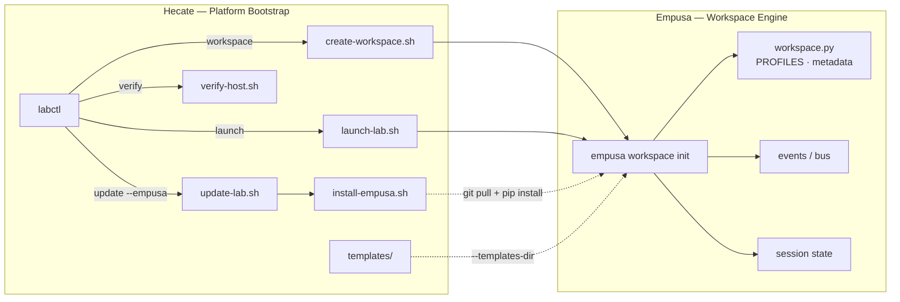

# Empusa Integration Contract

> Strict integration boundary between **Hecate** (platform bootstrap) and
> **Empusa** (workspace engine).  Every delegated call, path, and profile
> contract is documented here.  If either repo changes a contract surface,
> this file **must** be updated in the same commit.

---

## Boundary Diagram

---

## Responsibility Split

| Concern | Owner | Notes |
| --------- | ------- | ------- |
| Compose stack (up / down / build) | Hecate | `scripts/lib/compose.sh` |
| tmux profiles | Hecate | `tmux/profiles/*.sh` |
| Template files | Hecate | `templates/*.md` — Empusa receives via `--templates-dir` |
| `LAB_ROOT` directory tree | Hecate | Created by `bootstrap-host.sh` |
| Workspace profile definitions | **Empusa** | `empusa/workspace.py → PROFILES` |
| Directory scaffold + template seeding | **Empusa** | `create_workspace()` |
| Metadata file (`.empusa-workspace.json`) | **Empusa** | Written at workspace root |
| Lifecycle events | **Empusa** | `workspace.created`, `workspace.activated` via event bus |
| Session state | **Empusa** | Active workspace tracking |

---

## Delegated Commands

| Hecate Command | Script | Empusa Invocation | Inputs | Side Effects | Fallback |
| ---------------- | -------- | ------------------- | -------- | -------------- | ---------- |
| `labctl workspace <name> [--profile P]` | `create-workspace.sh` | `empusa workspace init --name NAME --profile P --root ${LAB_ROOT}/workspaces --templates-dir REPO/templates --set-active` | name (positional), profile (default `htb`) | Creates profiled workspace, seeds templates, writes metadata, emits events, sets active | `mkdir -p {notes,scans,loot,logs}` — no profile, no templates, no metadata, no events |
| `labctl launch <profile> [target]` | `launch-lab.sh` | Same invocation via `ensure_workspace()` | profile (positional), target/name (positional) | Same as above; script continues to compose up + tmux entry regardless of path | Same `mkdir` fallback; compose + tmux proceed normally |
| `labctl update --empusa` | `update-lab.sh` → `install-empusa.sh update` | *(none — manages venv, not workspace)* | — | `git pull` + `pip install -e .` inside venv | Non-fatal — update failure does not block platform update |

### Binary Resolution Order

Every delegating script resolves Empusa identically:

1. **Venv binary** — `${LAB_ROOT}/tools/venvs/empusa/bin/empusa`
2. **PATH lookup** — `command -v empusa`
3. **Shell fallback** — inline `mkdir`

The `[empusa]` / `[fallback]` log tag emitted by each script indicates
which path was taken.

---

## Installation Paths

| Path | Purpose |
| ------ | --------- |
| `${LAB_ROOT}/tools/git/empusa` | Cloned source repository |
| `${LAB_ROOT}/tools/venvs/empusa` | Isolated Python virtual environment |
| `${LAB_ROOT}/tools/venvs/empusa/bin/empusa` | Entry-point binary (resolution target) |

Managed by `scripts/install-empusa.sh` with three modes:

| Mode | Action |
| ------ | -------- |
| `install` | Clone repo → create venv → `pip install -e .` |
| `update` | `git pull` → `pip install -e .` |
| `reinstall` | Destroy venv → recreate → `pip install -e .` |

Override clone URL: `EMPUSA_REPO=https://github.com/Icarus4122/empusa.git`

---

## Workspace Profile Contract

Source of truth: `empusa/workspace.py → PROFILES`

| Profile | Directories | Templates | Template Source |
| --------- | ------------- | ----------- | ---------------- |
| `htb` | notes, scans, web, creds, loot, exploits, screenshots, reports, logs | engagement, target, recon, services, finding, privesc, web | `hecate-bootstrap/templates/` |
| `build` | src, out, notes, logs | *(none)* | — |
| `research` | notes, references, poc, logs | recon | `hecate-bootstrap/templates/` |
| `internal` | notes, scans, creds, loot, evidence, exploits, reports, logs | engagement, target, recon, services, finding, pivot, privesc, ad | `hecate-bootstrap/templates/` |

**Constants:**

- Metadata filename: `.empusa-workspace.json`
- Default workspace root: `/opt/lab/workspaces`
- Template variables: `{{NAME}}`, `{{PROFILE}}`, `{{DATE}}`

---

## Compatibility Notes

| Constraint | Detail |
| ------------ | -------- |
| Python version | Empusa requires `>=3.9` |
| Rich dependency | `rich>=13.0.0` (console output) |
| Template contract | Hecate `templates/` must contain every `.md` file listed in the active profile's `templates` list; missing files are recorded in `WorkspaceResult.templates_missing` but do not cause failure |
| Workspace root | Must exist and be writable before `empusa workspace init` is called; Hecate's bootstrap creates this |
| `--set-active` | Sets the active workspace in Empusa's session state; subsequent `empusa` commands operate against it |

---

## Failure & Degraded Mode

| Scenario | Behaviour | Severity |
| ---------- | ----------- | ---------- |
| Empusa not installed | Shell fallback: 4 generic directories, no profiles, no templates, no metadata, no events | Warning |
| Empusa binary found but crashes | Script exits non-zero; workspace not created | Error |
| `install-empusa.sh update` fails | Logged and skipped; platform update continues | Warning |
| Template file missing from `templates/` | Workspace created; missing template recorded in result, not seeded | Info |
| `labctl verify` — Empusa absent | `check_empusa()` emits `_warn`, not `_fail` — verification passes | Warning |

---

## Source of Truth

| Artefact | Authoritative Location |
| ---------- | ---------------------- |
| Profile definitions (dirs + templates) | `empusa/empusa/workspace.py → PROFILES` |
| Metadata schema | `empusa/empusa/workspace.py → WorkspaceResult` |
| Template files | `hecate-bootstrap/templates/*.md` |
| Delegation logic | `hecate-bootstrap/scripts/create-workspace.sh`, `launch-lab.sh` |
| Install / update lifecycle | `hecate-bootstrap/scripts/install-empusa.sh` |
| Verification check | `hecate-bootstrap/scripts/verify-host.sh → check_empusa()` |
| This contract | `hecate-bootstrap/docs/empusa.md` |
